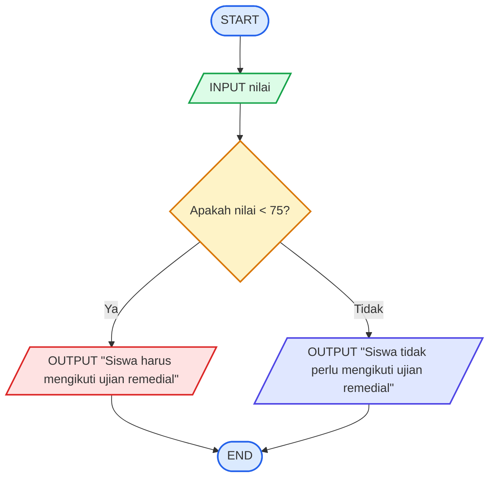

# Logika Matematika - Sistem Remedial
## **Deskripsi Masalah**
Di sebuah sekolah, terdapat aturan mengenai ujian remedial matematika. Siswa yang mendapatkan nilai kurang dari 75 harus mengikuti ujian remedial, sedangkan siswa yang mendapatkan nilai 75 atau lebih tidak perlu mengikuti remedial. Masalah ini dapat digunakan untuk menerapkan logika matematika dengan melihat hubungan antara nilai yang diperoleh siswa dan keputusan untuk mengikuti remedial. Program nantinya akan menerima nilai matematika siswa, kemudian menentukan apakah siswa perlu mengikuti remedial berdasarkan aturan yang telah ditentukan.
## **Input-Proses-Output**
**Input:** Nilai ujian matematika yang diperoleh siswa.

**Proses:** Program membandingkan nilai siswa dengan batas nilai 75. Jika nilai kurang dari 75, siswa perlu mengikuti remedial. Jika nilai 75 atau lebih, siswa tidak perlu mengikuti remedial.

**Output:** Keterangan apakah siswa perlu mengikuti remedial atau tidak.
## **Pseudocode**
```text
INPUT nilai

IF nilai < 75 THEN
    OUTPUT "Siswa harus mengikuti ujian remedial"
ELSE
    OUTPUT "Siswa tidak perlu mengikuti ujian remedial"
END IF
```
## **Flowchart**

## **Test Case**
| Test Case | Input Nilai | Kondisi | Hasil yang Diharapkan |
|---|---:|---|---|
| 1 | 60 | Nilai < 75 | Siswa harus mengikuti ujian remedial |
| 2 | 80 | Nilai ≥ 75 | Siswa tidak perlu mengikuti ujian remedial |
