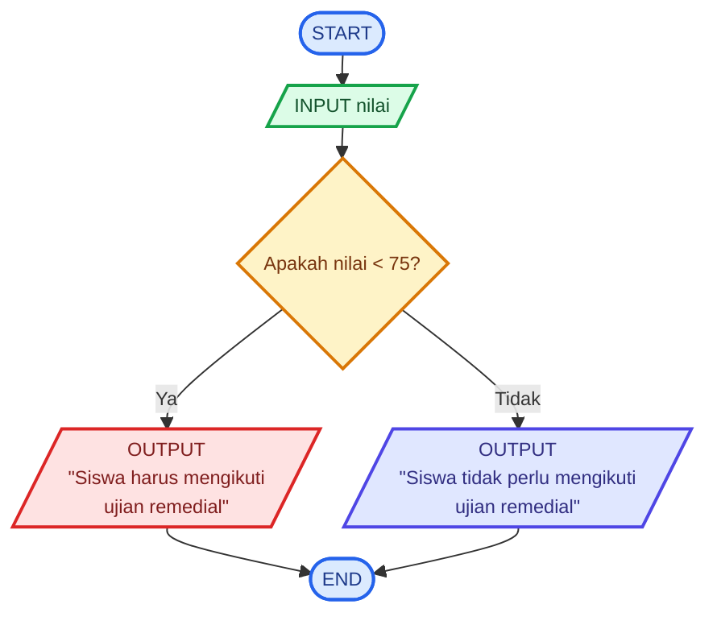

# 🧮 Logika Matematika - Sistem Remedial

## 📝 **Deskripsi Masalah**
Di sebuah sekolah, terdapat aturan mengenai ujian remedial matematika. Siswa yang mendapatkan nilai kurang dari 75 harus mengikuti ujian remedial, sedangkan siswa yang mendapatkan nilai 75 atau lebih tidak perlu mengikuti remedial.
Masalah ini dapat digunakan untuk menerapkan logika matematika dalam menentukan suatu keputusan berdasarkan kondisi yang diberikan. Program akan menerima nilai matematika siswa sebagai input, kemudian mengevaluasi apakah nilai tersebut kurang dari 75 atau tidak. Berdasarkan hasil evaluasi tersebut, program akan menentukan apakah siswa perlu mengikuti ujian remedial atau tidak.

## 📥 **Input-Proses-Output**
**Input:** Nilai ujian matematika yang diperoleh siswa.

**Proses:** Program membandingkan nilai siswa dengan batas nilai 75. Jika nilai kurang dari 75, siswa perlu mengikuti remedial. Jika nilai 75 atau lebih, siswa tidak perlu mengikuti remedial.

**Output:** Apakah siswa perlu mengikuti remedial atau tidak.

## 💻 **Pseudocode**
```text
INPUT nilai

IF nilai < 75 THEN
    OUTPUT "Siswa harus mengikuti ujian remedial"
ELSE
    OUTPUT "Siswa tidak perlu mengikuti ujian remedial"
END IF
```
## 📊 **Flowchart**



## 🧪 **Test Case**
| Test Case | Input Nilai | Kondisi | Hasil yang Diharapkan |
|---|---:|---|---|
| 1 | 60 | Nilai < 75 | Siswa harus mengikuti ujian remedial |
| 2 | 80 | Nilai ≥ 75 | Siswa tidak perlu mengikuti ujian remedial |

## 🐍 **Implementasi Python**

Implementasi program dibuat menggunakan Python dan dijalankan melalui Visual Studio Code,
Source code dapat dilihat pada **[main.py](main.py)**.

## 📸 **Hasil Pengujian**
Program telah berhasil diuji menggunakan dua nilai, yaitu 60 dan 80 sesuai dengan test case, dan menghasilkan output sesuai dengan kondisi yang telah ditentukan.


